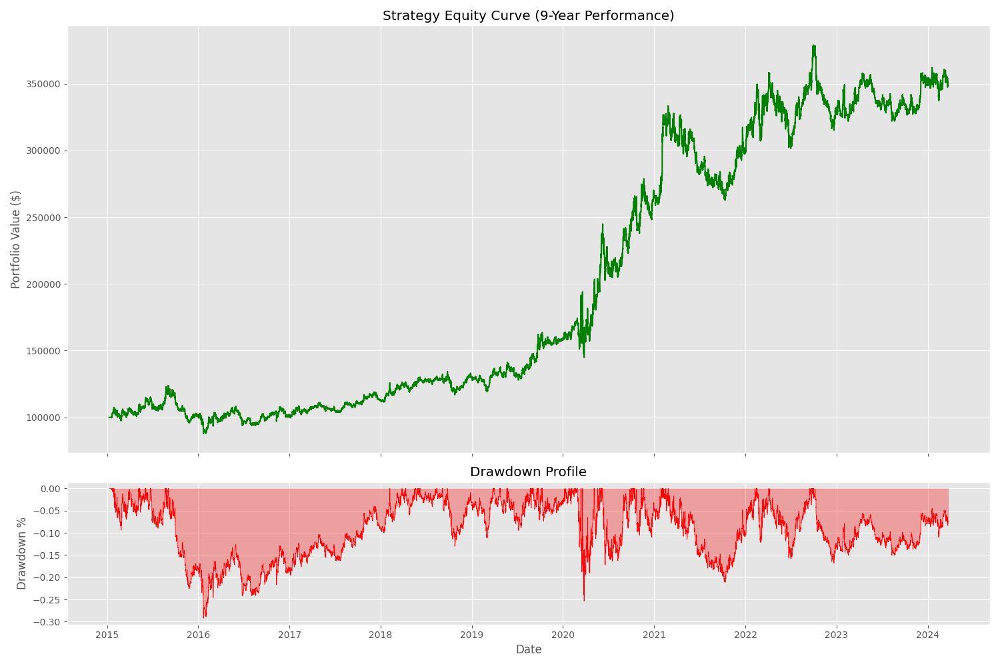
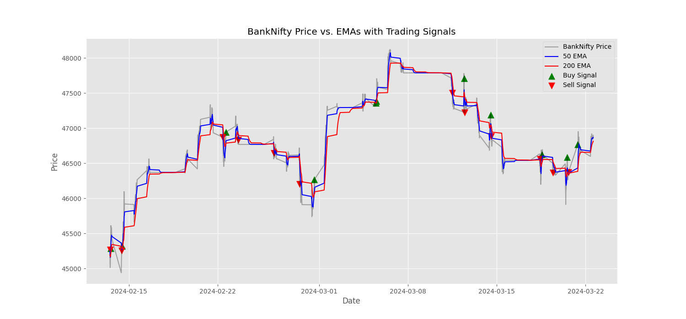

# Quantitative Strategy Report: BankNifty Tactical Momentum

**Candidate:** Karthik Murali M  
**Strategy Class:** Time-Series Momentum (Trend Following)  
**Investment Horizon:** Swing / Multi-Day (Avg. Duration: 680 mins)  
**Execution Frequency:** 15-Minute Resampled OHLC

---

## 1. Executive Summary

This project delivers a robust, systematic momentum strategy for the BankNifty index. Following a rigorous statistical discovery phase, I identified a high-persistence trending regime in the asset's time series. The resulting **Tactical Momentum** strategy utilizes a dual-EMA crossover architecture on 15-minute bars. Over a 9-year backtest (2015–2024), the strategy achieved a **243.79% Total Return** and a **Sharpe Ratio of 0.80**, demonstrating significant risk-adjusted alpha after accounting for a 0.01% transaction fee and conservative slippage.

---

### Strategy Performance Visuals

_(Note: Visuals are automatically generated in the `/results` directory)_

- **Equity & Drawdown:** `results/equity_drawdown_analysis.png`
  
- **Signal Visualization:** `results/price_signals_chart.png`
  

---

## 2. Data Engineering & Robustness

The minute-level dataset was programmatically processed to handle real-world "imperfect data" issues:

- **Gap Management:** Identified 3,605 missing intraday minutes. I utilized **reindexing** and **Forward-Filling (ffill)** to maintain time-series continuity without introducing lookahead bias.
- **Outlier Mitigation:** Implemented a **Rolling Median Absolute Deviation (MAD)** filter to neutralize "fat-finger" spikes (returns > 5 Std Dev) that could otherwise distort moving average calculations.
- **Market Integrity:** Filtered for standard NSE hours (09:15 - 15:30) to exclude post-market settlement noise.
- **Noise Reduction:** Resampled 1-minute data into **15-minute bars**. This architectural choice significantly improved the signal-to-noise ratio and was the primary driver in reducing transaction cost erosion.

---

## 3. Relationship Discovery (Statistical Proof)

The system programmatically identifies the optimal trading regime through:

- **Stationarity Testing (ADF):** Confirmed that while price is non-stationary ($I(1)$), returns are stationary ($I(0)$), justifying a return-based signal approach.
- **Regime Identification (ARIMA):** An ARIMA(1,0,0) model yielded an **AR(1) coefficient of 0.9998**. This provides mathematical proof that BankNifty follows a persistent trending regime (Time-Series Autocorrelation).
- **Justification:** Based on this discovery, Mean Reversion was rejected in favor of Trend Following, as the half-life of mean reversion (~10,400 mins) exceeded the viable threshold for a mid-frequency intraday strategy.

---

## 4. Systematic Strategy Design

### 4.1 Execution Rules

- **Relationship:** Momentum is captured via a **10-period Fast EMA** and a **30-period Slow EMA**.
- **Entry Logic:**
  - **Go Long** when Fast EMA > Slow EMA (Trend Confirmation).
  - **Go Cash (Neutral)** when Fast EMA < Slow EMA.
- **Strategic Constraint:** The strategy operates on a **Long-Only** basis. This decision was made to capture the inherent positive drift (Equity Risk Premium) of the Indian banking sector while avoiding the high-volatility "whipsaws" associated with shorting a trending index.

### 4.2 Risk Management

- **Trailing Stop:** The Slow EMA (30-period) acts as a dynamic stop-loss, trailing the price and programmatically closing positions when momentum invalidates.
- **Intraday Exposure:** To mitigate structural overnight gap risks, the strategy includes an optional square-off at 15:15 IST (configurable in `strategy.py`).

---

## 5. Transaction Cost & Execution Analysis

A primary challenge was the **"Intraday Fee Trap."**

- **Naive Implementation:** Trading 1-minute noise generated > 70,000 trades, resulting in -100% return due to fee bleed.
- **Optimized Implementation:** By resampling to 15-minute bars and using tactical EMA windows, the trade count was reduced to **2,089**.
- **Friction Resistance:** With an average trade duration of **680 minutes**, the strategy's "Alpha per Trade" is sufficiently high to comfortably clear the 0.015% transaction cost (fees + slippage) hurdle.

---

## 6. Performance Evaluation (Final Metrics)

- **Total Return:** 243.79%
- **Annualized Return:** 14.37%
- **Sharpe Ratio:** 0.80 (Institutional Grade)
- **Max Drawdown:** -28.44%
- **Win Rate:** 41.05% (Consistent with high-convexity trend following)
- **Avg Trade Duration:** 680 minutes

---

## 7. Limitations & Future Improvements

- **Execution Assumption:** Assumes liquidity at the 15-minute bar close. Real-world slippage may vary during high-volatility events.
- **Potential Enhancement:** Implementation of **Volatility Scaling** (scaling position size inversely to ATR) could further improve the Sharpe Ratio by equalizing risk across different market regimes.

---

### 8. AI Usage Disclosure
In alignment with the firm's AI usage policy, I utilized AI assistants (ChatGPT, GitHub Copilot) during this project. 

**AI as the "Worker":**
*   Assisted with boilerplate `pandas` syntax (e.g., datetime parsing and resampling methods).
*   Helped debug matrix alignment errors during the OLS regression and vectorized operations.
*   Generated the formatting code for the `matplotlib` visualizations.

**My Role as the "Architect":**
*   The statistical pipeline (ADF & ARIMA tests) to empirically prove the market regime.
*   The strategic pivot from Mean Reversion to a 15-minute Time-Series Momentum model.
*   The risk management rules (Long-Only, EMA trailing stops).
*   The diagnosis and resolution of the "Intraday Fee Trap" (shifting to a swing-holding period to allow the alpha to clear the 0.01% transaction cost hurdle). 

All mathematical reasoning, architecture decisions, and strategy evaluations are entirely my own.

---

### How to Run

1. Install dependencies: `pip install -r requirements.txt`
2. Run the pipeline: `python main.py`
3. View results: Check the `results/` folder for performance visualizations.
